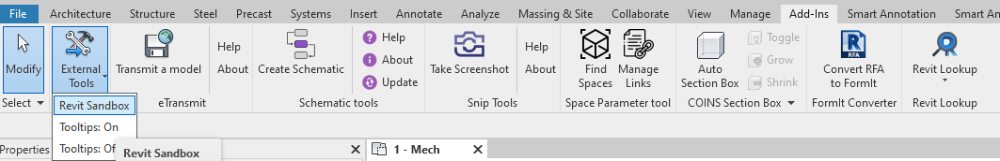
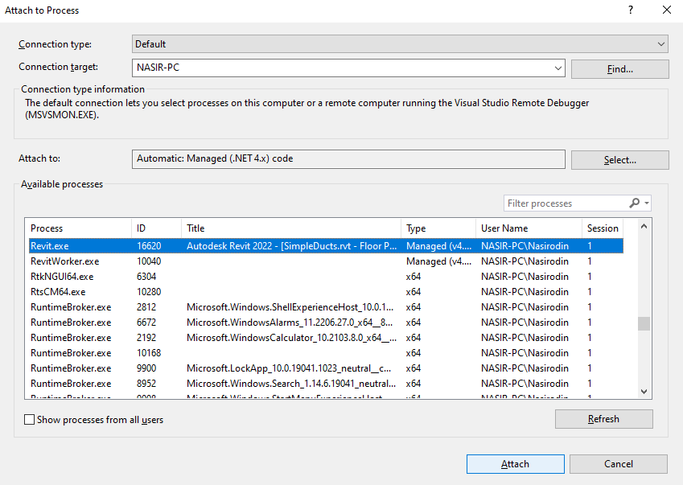

# Revit-Sandbox
A simple sandbox project to start with Revit API. Autodesk Revit is a Building Information Modeling (BIM) software that allows architects, engineers, and construction professionals to design, plan, and manage building projects more efficiently. Revit add-ons are custom plugins developed using the Revit API to extend the functionalities of Revit and enhance its capabilities.


## Requirements
* [Microsoft Visual Studio](https://visualstudio.microsoft.com/)
* [Autodesk Revit 2023](https://www.autodesk.com/products/revit/free-trial)

## Development
All project dependencies (including `Revit API`) are managed using the Nuget package manager. To set up the project, restore the Nuget packages and rebuild the project.

The Revit API allows you to interact with Revit through its Application Programming Interface (API). This lets developers create custom tools, automate tasks, and enhance the software's capabilities. The sample command function, located in `Commands\SampleCommand.cs`, demonstrates how to create a simple command that is called automatically by Revit whenever a user selects the given command from the `External Tools` Menu.



For a comprehensive introduction to developing Revit plugins, follow the Autodesk tutorial on [My First Revit Plug-in](https://knowledge.autodesk.com/search-result/caas/simplecontent/content/my-first-revit-plug-overview.html). This learning path provides valuable resources to help you get started.

## Add-in Registration
Revit API applications are registered with Revit via a .addin manifest file. These files tell Revit which plugins to load during startup, specifying their details and locations.

Manifest files are read automatically by Revit when they are placed in one of two locations on a user's system:

In a non-user-specific location in "application data":
```
%programdata%\Autodesk\Revit\Addins\2023\
```
In a user-specific location in "application data":
```
%appdata%\Autodesk\Revit\Addins\2023\
```
All files with the .addin extension in these locations are scanned and processed by Revit during its startup process. The files from both user-specific and all-users locations are combined and loaded in alphabetical order. If a manifest file in the all-users location has the same name as one in the user-specific location, the all-users manifest file will be disregarded. Within each manifest file, the external commands and external applications are loaded sequentially, based on the order they are listed.


`Revit-Sandbox.addin` is a basic manifest file adding one ExternalCommand

## Debugging

To debug your plugin, first launch Revit and then attach the Visual Studio debugger to the running process. Open the `Attach to Process` window from the `Debug` menu, and select `Revit.exe` to attach the debugger.



Once the debugger is attached, you can execute your command, and any breakpoints set in the code will be hit automatically. Ensure that you have copied the latest version of your assemblies from the `Debug` directory to the `Addins` folder. You can automate the process of copying the latest assemblies to the `Addins` folder using project post-build events.

Another valuable tool for the debugging process is [Revit Lookup](https://github.com/jeremytammik/RevitLookup). With this plugin, you can select any Revit element and extract all of its properties, which can be extremely helpful for understanding the Revit object model and identifying issues.
